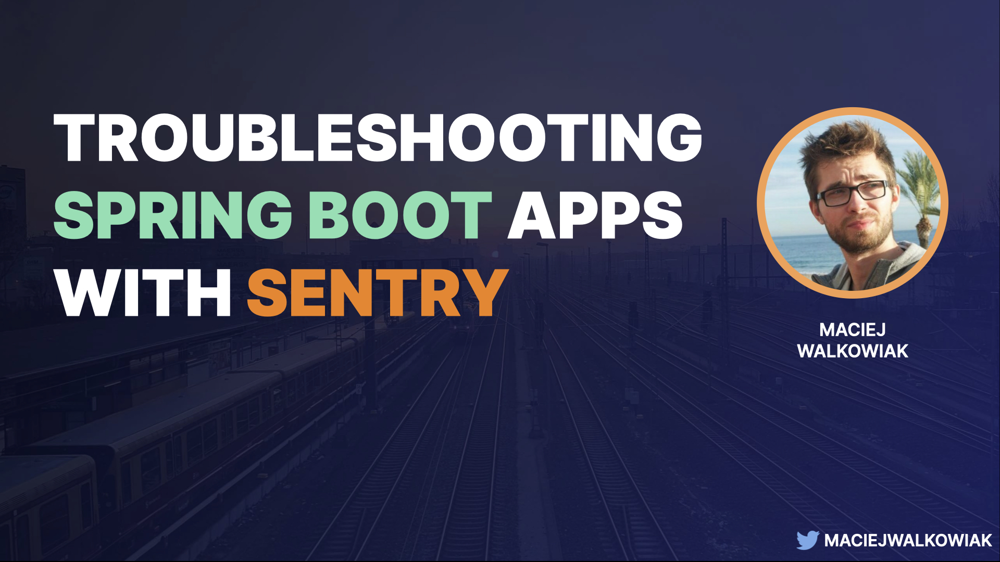

# Troubleshooting Spring Boot Applications with Sentry

Source for the talk "Troubleshooting Spring Boot Applications with Sentry".



## Abstract

No matter how clean our code is, how good our tests are, how well our infrastructure scales - one day, eventually something will go wrong in production. Bugs and outages cases customer to lose trust and cost real money. Our job is to identify and fix the issue as quickly as possible.    In this session, we will have a look at Sentry - an open source troubleshooting and application monitoring solution - and its seamless integration with Spring Boot. We will learn the benefits of treating errors as contextual events and how exception reporting and performance monitoring in a single tool simplify addressing production issues.

## Slides

[Slides at Speakerdeck](https://speakerdeck.com/maciejwalkowiak/troubleshooting-spring-boot-applications-with-sentry)

## How to run

Project contains 2 demos:

1. [Manual](https://github.com/maciejwalkowiak/troubleshooting-spring-boot-appplications-with-sentry/tree/main/manual) - simple console application, showing how to initialize and use Sentry SDK directly and how to use Logback integration.
2. Distributed system - containing React based frontend and 2 backend services built with Spring Boot.

Requirements to run the demo:

- Docker to run RabbitMQ through `docker-compose.yml`, or RabbitMQ running locally
- Java 17 (can be easily installed with [SdkMan](https://sdkman.io/))

### Create projects in Sentry

Once you sign in to [sentry.io](https://sentry.io) create 4 projects:

1. Name: `hello-world`, type: **Java** - copy the DSN to [Main.java](https://github.com/maciejwalkowiak/troubleshooting-spring-boot-appplications-with-sentry/blob/main/manual/src/main/java/hr/javacro/Main.java#L14)
2. Name: `react-frontend`, type: **React** - copy the DSN to [index.js](https://github.com/maciejwalkowiak/troubleshooting-spring-boot-appplications-with-sentry/blob/main/react-frontend/src/index.js#L12)
3. Name: `movies-service`, type: **Spring Boot** - copy the DSN to [application.properties](https://github.com/maciejwalkowiak/troubleshooting-spring-boot-appplications-with-sentry/blob/main/spring-movies-service/src/main/resources/application.properties)
3. Name: `rating-service`, type: **Spring Boot** - copy the DSN to [application.properties](https://github.com/maciejwalkowiak/troubleshooting-spring-boot-appplications-with-sentry/blob/main/spring-rating-service/src/main/resources/application.properties)

### Run services

Go to `react-frontend` and run:

```
yarn start
```

The application will be running on [http://localhost:3000](http://localhost:3000).

Go to `spring-movies-service` and run:

`mvn spring-boot:run`

The application will be running on [http://localhost:3000](http://localhost:8080).

Go to `spring-rating-service` and run:

The application will be running on [http://localhost:3000](http://localhost:8081).

`mvn spring-boot:run`
